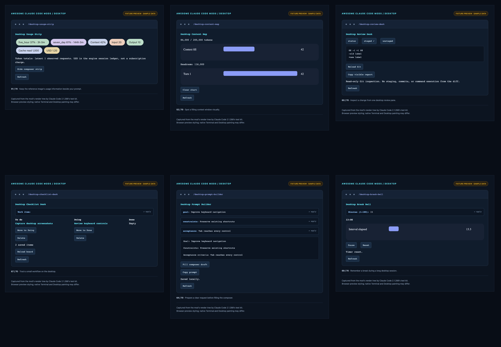

# 20 mods for Claude Desktop

These plugins target the **Code tab** in Claude Desktop, using the supported Claude Code mods API. They include Desktop-only SVG charts, a composer usage band, responsive columns, and clickable controls. The original 50 plugins remain available.



The reference [image](https://pbs.twimg.com/media/HTqDCmTXIAAUvT2?format=jpg&name=medium) shared in [this post](https://x.com/thegenioo/status/2106139975922409585) inspired Desktop Usage Strip. We inspected the image; the post itself could not be fetched. The implementation is original and uses engine-reported data.

## Install now

Requires Claude Code **2.1.287+** and a local Code session in Claude Desktop. The native test baseline is **2.1.288**. Mods do not extend Desktop's Chat or Cowork tabs, and WSL Desktop sessions do not support plugins. [Official supported surfaces](https://code.claude.com/docs/en/plugins/mods/overview#where-mods-run).

From a terminal in this checkout:

```sh
claude plugin marketplace add .
claude plugin install desktop-usage-strip@awesome-claude-code-mods
```

Or use the published repository:

```sh
claude plugin marketplace add whyashthakker/awesome-claude-code-mods
claude plugin install desktop-usage-strip@awesome-claude-code-mods
```

Start a new **local Code session** in Claude Desktop, or run `/reload-plugins` in an existing Code session, then `/desktop-usage-strip`. Install any other mod by replacing `desktop-usage-strip` with its ID in the table below. Every plugin is independent; no Python, bundler, runtime packages, or model calls are needed.

If the marketplace is already registered, refresh it with `claude plugin marketplace update awesome-claude-code-mods` before installing a newly added mod. Desktop also supports plugin installation through its plugin interface; the CLI commands install at user scope by default. [Official installation guide](https://code.claude.com/docs/en/plugins).

Click controls, or use Tab and Enter. Esc closes a pane. Wider panes show columns side by side; narrower panes stack them. Unsupported CLI/headless commands explain that the Desktop Code tab is required.

## Choose a desktop mod

| Command / plugin ID | What it does |
| --- | --- |
| [desktop-usage-strip](../mods/desktop-usage-strip/README.md) | Pastel quota/reset, context, token, and USD chips above the composer, plus a detailed pane and hide/show toggle. |
| [desktop-context-map](../mods/desktop-context-map/README.md) | Context fill/headroom gauge with a chart sampled after completed turns. |
| [desktop-quota-clock](../mods/desktop-quota-clock/README.md) | Quota gauges with minute-by-minute reset countdowns. |
| [desktop-cost-watch](../mods/desktop-cost-watch/README.md) | Saved workspace budget target and session USD gauge; reminder only. |
| [desktop-token-flow](../mods/desktop-token-flow/README.md) | Input/output/cache-read/cache-write token charts from observed requests. |
| [desktop-tool-pulse](../mods/desktop-tool-pulse/README.md) | Tool latency chart, counts, and failures. |
| [desktop-turn-chart](../mods/desktop-turn-chart/README.md) | Turn durations with interrupted-turn labels. |
| [desktop-edit-map](../mods/desktop-edit-map/README.md) | Edit/Write activity chart grouped by file path. |
| [desktop-agent-desk](../mods/desktop-agent-desk/README.md) | Searchable reported agent roster and copyable status snapshot. |
| [desktop-review-desk](../mods/desktop-review-desk/README.md) | Git status/staged/unstaged tabs with copy and refresh. |
| [desktop-file-desk](../mods/desktop-file-desk/README.md) | Chosen text file, line filter, and a draft question about its path. |
| [desktop-markdown-reader](../mods/desktop-markdown-reader/README.md) | Markdown rendering and source tabs for a local .md file. |
| [desktop-compare-desk](../mods/desktop-compare-desk/README.md) | Two text previews side by side with differing line positions. |
| [desktop-prompt-builder](../mods/desktop-prompt-builder/README.md) | Saved goal/constraints/acceptance fields with composer-fill and copy actions. |
| [desktop-session-brief](../mods/desktop-session-brief/README.md) | Observed activity counts plus a manual next-step note, ready to copy. |
| [desktop-bookmark-dock](../mods/desktop-bookmark-dock/README.md) | Saved HTTP/HTTPS reference links with copy/delete. |
| [desktop-checklist-desk](../mods/desktop-checklist-desk/README.md) | Saved To do/Doing/Done board with move and delete controls. |
| [desktop-workspace-home](../mods/desktop-workspace-home/README.md) | Workspace path, Git state, context, and cost at a glance. |
| [desktop-break-bell](../mods/desktop-break-bell/README.md) | Adjustable countdown with pause/reset, progress SVG, and a completion toast. |
| [desktop-json-desk](../mods/desktop-json-desk/README.md) | Pasted JSON validation, searchable top-level keys, and a formatted copy. |

The searchable [gallery](../gallery.html) includes a **Desktop** category containing exactly these 20 plugins, and each README includes a screenshot of its actual Desktop-surface native test-kit tree rendered in the fixture browser preview.

## Usage strip details

Only fields reported by the host are displayed as measurements. Missing context/cost fields say **not reported**; absent quota windows are omitted. A reset countdown reaching zero says it is due and awaiting a new report; it does not assume quota was replenished.

Input/output/cache totals cover the latest 30 observed API requests, beginning when the plugin loads, including agent requests that pass through the session. The USD chip is the engine's session cost ledger, not a subscription bill. The strip composes with other mods' AbovePrompt content and yields when a survey owns the band. Use its command pane if your Desktop build does not expose the composer band. [Render sites and Desktop SVG support](https://code.claude.com/docs/en/plugins/mods/reference#render-sites).

The current public GitHub declarations and web reference disagree about some Desktop render sites. We tested the installed 2.1.288 engine's Desktop-surface element validation and band composition; we have not verified pixels in the native Desktop app. The pane is the supported alternate view.

## Check and troubleshoot

```sh
claude --version
claude plugin validate mods/desktop-usage-strip --strict
claude plugin test mods/desktop-usage-strip
python3 scripts/check.py
python3 scripts/audit.py
```

If a mod does not appear, confirm that you opened the local **Code** tab, installed the plugin at user scope, and reloaded plugins or started a new session. Managed organization settings can restrict plugins/mods. [Official troubleshooting](https://code.claude.com/docs/en/plugins/mods/troubleshoot).

Histories reset on reload. Saved budgets, prompt fields, bookmarks, and checklist items use the local plugin store partitioned by workspace. Refresh/reopen to pick up saved changes from another session; concurrent changes to the same saved key use last-write-wins behavior. File viewers read bounded user-chosen paths and refuse symlinks; Git processes use read-only argv operations. Composer fill replaces the current draft and never sends it. Timers stop with the session. See [access details](../SECURITY.md) and [validation evidence](VALIDATION.md).
