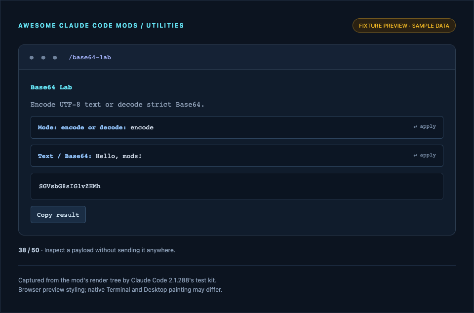

# Base64 Lab

Encode UTF-8 text or decode strict Base64.

**Use it when:** Inspect a payload without sending it anywhere.



*Screenshot of this mod's render tree in the fixture preview, with sample data. This is not a capture of the Claude Code application. [How previews are made](../../docs/SCREENSHOTS.md).*

## Install and open

```sh
claude plugin marketplace add whyashthakker/awesome-claude-code-mods
claude plugin install base64-lab@awesome-claude-code-mods
```

Run `/reload-plugins` in an existing session, then `/base64-lab`. Use Tab and Enter to operate controls; Esc closes the pane. Terminal and Desktop Code tab supported; pane UI is unavailable in `claude -p` and the VS Code chat panel.

Try the source without installing:

```sh
claude --plugin-dir ./mods/base64-lab
```

## Access and behavior

Works on the text you enter, in memory. Uses the clipboard on request. No files, processes, network, persistence, or model calls.

Module variables reset on hot reload. All display output is bounded; viewers may truncate long content to 9,000 characters. Relative file paths and Git commands use the session working directory.

## Verify

Tested with Claude Code **2.1.288**. Minimum documented mods version: **2.1.287**. The API can change; validate against your installed version.

```sh
claude plugin validate mods/base64-lab --strict
claude plugin test mods/base64-lab
```

Tests cover plugin commands, pane isolation, both UI surfaces, and the behavior described in `tests/register.test.ts`. Drawing tests validate element trees; they do not verify pixels painted by the native apps. [Validation details](../../docs/VALIDATION.md).

MIT licensed. No runtime packages or build step required.
