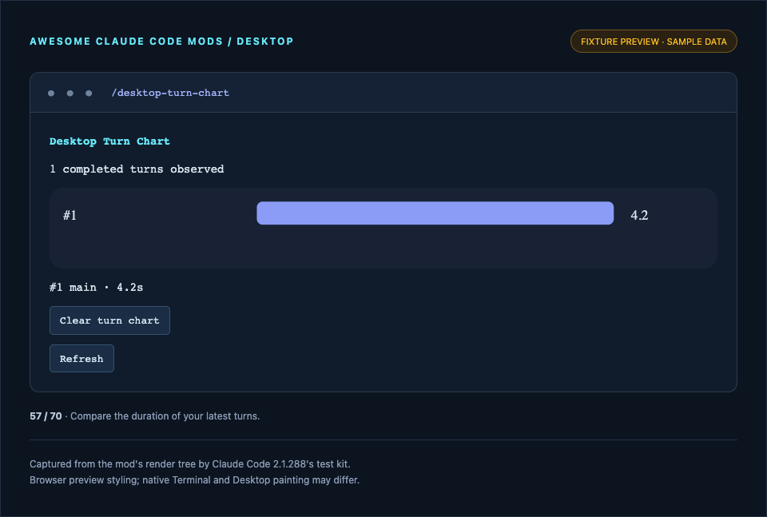

# Desktop Turn Chart

Chart turn durations with interruption labels.

**Use it when:** Compare the duration of your latest turns.



*Desktop-surface native test-kit tree, painted in a browser fixture preview with sample data. This is not a Claude Desktop app capture. [Provenance](../../docs/SCREENSHOTS.md).*

## Install and open

Requires Claude Code 2.1.287+ in the **Claude Desktop Code tab**; tested with 2.1.288's native test kit. Chat/Cowork tabs do not host this API. WSL Desktop sessions do not support plugins. No runtime packages or build step.

Install the current checkout immediately from a terminal in this repository:

```sh
claude plugin marketplace add .
claude plugin install desktop-turn-chart@awesome-claude-code-mods
```

Or install the published collection:

```sh
claude plugin marketplace add whyashthakker/awesome-claude-code-mods
claude plugin install desktop-turn-chart@awesome-claude-code-mods
```

Start a new **local Code session** in Claude Desktop, or run `/reload-plugins` in an open Code session, then `/desktop-turn-chart`. Click controls or use Tab and Enter; Esc closes the pane. Non-Desktop commands return a compatibility explanation. [Desktop setup and all 20 mods](../../docs/DESKTOP.md).

## Access and behavior

Observes durations, agent IDs and interruption flags for the latest 12 completed turns; memory only.

Histories begin at load and reset on reload; no earlier activity is reconstructed. Store keys use the workspace directory; saved items are local to this plugin. Files/processes use session cwd. Stored content and clipboard exports can contain private information. No model calls, automatic prompt submissions, or permission approvals.

## Verify

```sh
claude plugin validate mods/desktop-turn-chart --strict
claude plugin test mods/desktop-turn-chart
```

Native tests cover command opening, pane isolation, Desktop controls at two widths, unsupported surfaces, error/empty states, and preview capture. These checks validate element trees and callbacks; native Desktop painting and keyboard acceptance remain a manual check. [Validation](../../docs/VALIDATION.md).

MIT licensed, with source and tests included.
