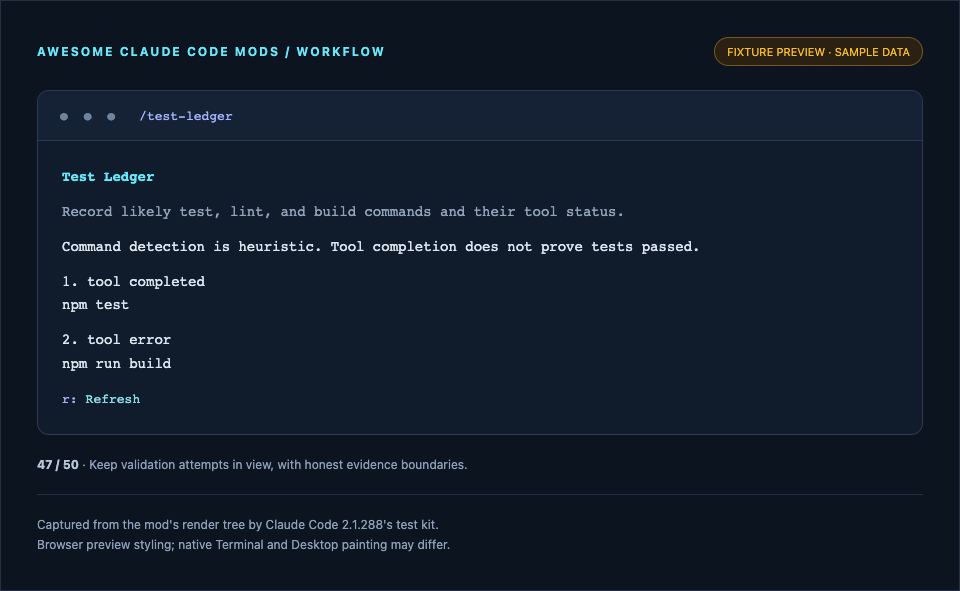

# Test Ledger

Record likely test, lint, and build commands and their tool status.

**Use it when:** Keep validation attempts in view, with honest evidence boundaries.



*Screenshot of this mod's render tree in the fixture preview, with sample data. This is not a capture of the Claude Code application. [How previews are made](../../docs/SCREENSHOTS.md).*

## Install and open

```sh
claude plugin marketplace add whyashthakker/awesome-claude-code-mods
claude plugin install test-ledger@awesome-claude-code-mods
```

Run `/reload-plugins` in an existing session, then `/test-ledger`. Use Tab and Enter to operate controls; Esc closes the pane. Terminal and Desktop Code tab supported; pane UI is unavailable in `claude -p` and the VS Code chat panel.

Try the source without installing:

```sh
claude --plugin-dir ./mods/test-ledger
```

## Access and behavior

Observes Bash command strings and tool status in memory. Does not execute commands.

Module variables reset on hot reload. Diagnostic history begins when the mod loads and lasts until reload or process exit; it does not reconstruct earlier activity. All display output is bounded; viewers may truncate long content to 9,000 characters. Relative file paths and Git commands use the session working directory.

## Verify

Tested with Claude Code **2.1.288**. Minimum documented mods version: **2.1.287**. The API can change; validate against your installed version.

```sh
claude plugin validate mods/test-ledger --strict
claude plugin test mods/test-ledger
```

Tests cover plugin commands, pane isolation, both UI surfaces, and the behavior described in `tests/register.test.ts`. Drawing tests validate element trees; they do not verify pixels painted by the native apps. [Validation details](../../docs/VALIDATION.md).

MIT licensed. No runtime packages or build step required.
